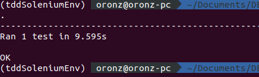

## TDD Step by Step Explanation(Buildng simple bog)

```python


from selenium import webdriver

browser=webdriver.Firefox()
browser.get('http://localhost:8000')
assert('Blog' in browser.title)

```
Our first test will load the selenium driver and automaticaly opens the browser(Both Firefox and chrome can be used)
For chrome Installlation of chromedriver is mandatory and sometimes geckodriver is required for firefox


###  Unittest 2 Main Fucntions

     setUp() and tearDown()

 A testing unit should focus on one tiny bit of functionality and prove it correct.This is always loaded a fresh and cleaned up thereafter
 Loading is done using setUp()
 Cleaning using tearDown()


 #### Now lets make it pass

 Intall django and create project
```python
pip install django
```
Startproject
```python
django-admin startproject blog
```
Run server and run our tdd_tests_scrip.py file and see our test fail again


Create html index file and set title to Blog and boom,our first test will pass

Here's the pass image  in action:


